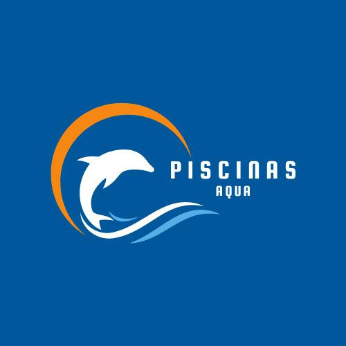

# 🏊‍♂️ Piscinas Aqua - Sitio Web Profesional

<div align="center">
  
  
  [](https://developer.mozilla.org/en-US/docs/Web/HTML)
  [](https://developer.mozilla.org/en-US/docs/Web/CSS)
  [](https://developer.mozilla.org/en-US/docs/Web/JavaScript)
  [](https://web.dev/responsive-web-design-basics/)
</div>

## 📋 Descripción

**Piscinas Aqua** es un sitio web profesional desarrollado para una empresa especializada en la construcción de piscinas de hormigón y arena. El proyecto presenta una solución web completa, moderna y responsive que destaca los servicios, experiencia y calidad de la empresa.

### 🎯 Objetivo del Proyecto

Crear una presencia digital profesional que permita a Piscinas Aqua:
- Mostrar sus servicios de manera atractiva y detallada
- Generar confianza a través de información corporativa
- Facilitar el contacto con clientes potenciales
- Destacar su experiencia y proyectos realizados

---

## ✨ Características Principales

### 🎨 **Diseño y UX**
- **Diseño Responsive** - Adaptación perfecta a móviles, tablets y desktop
- **Paleta de Colores Corporativa** - Azul agua (#0077be) como color principal
- **Animaciones Suaves** - Efectos CSS modernos y transiciones fluidas
- **Tipografía Profesional** - Jerarquía visual clara y legible
- **Navegación Intuitiva** - Menú sticky con hamburger móvil

### 🚀 **Funcionalidades**
- **Formulario de Contacto** con validación en tiempo real
- **Galería Interactiva** con modal y sistema de filtros
- **Smooth Scrolling** y efectos parallax
- **Lazy Loading** de imágenes para mejor performance
- **Notificaciones Dinámicas** para feedback del usuario
- **Integración WhatsApp** para contacto directo

### 📱 **Optimización**
- **SEO Optimizado** - Meta tags y estructura semántica
- **Performance** - Código minificado y optimizado
- **Accesibilidad** - Cumple estándares WCAG
- **Cross-browser** - Compatible con todos los navegadores modernos

---

## 🏗️ Estructura del Proyecto

```
📁 Piscinas Aqua/
├── 📄 index.html              # Página principal
├── 📄 quienes-somos.html      # Información corporativa
├── 📄 servicios.html          # Servicios detallados
├── 📄 galeria.html            # Galería de proyectos
├── 📄 contacto.html           # Formulario y contacto
├── 📄 logo.jpeg               # Logo principal
├── 📁 assets/
│   ├── 📁 css/
│   │   ├── 📄 style.css       # Estilos globales
│   │   ├── 📄 home.css        # Estilos página principal
│   │   ├── 📄 quienes-somos.css
│   │   ├── 📄 servicios.css
│   │   ├── 📄 galeria.css
│   │   └── 📄 contacto.css
│   ├── 📁 js/
│   │   ├── 📄 main.js         # Funcionalidades globales
│   │   ├── 📄 home.js         # Scripts página principal
│   │   ├── 📄 galeria.js      # Funcionalidad galería
│   │   └── 📄 contacto.js     # Validación formularios
│   └── 📁 img/
│       ├── 📄 logo.jpeg
│       └── 📁 galeria/
│           ├── 📁 proyecto1/
│           ├── 📁 proyecto2/
│           └── 📁 proyecto3/
├── 📁 docs/                   # Documentación del cliente
└── 📁 MD/                     # Archivos de información
    ├── 📄 info.md
    └── 📄 estructura.md
```

---

## 🎯 Páginas y Secciones

### 🏠 **Página Principal (index.html)**
- **Hero Section** con título principal y llamada a la acción
- **Servicios Destacados** con cards interactivas
- **¿Por qué elegirnos?** con características principales
- **Call to Action** para generar contactos

### 👥 **Quiénes Somos (quienes-somos.html)**
- **Historia de la empresa** - 5 años de experiencia
- **Misión y Visión** corporativa
- **Nuestro Equipo** - Profesionales especializados
- **Valores** - Excelencia, confiabilidad, cercanía
- **Estadísticas** - Proyectos completados y satisfacción

### 🔧 **Servicios (servicios.html)**
- **Construcción de Piscinas de Hormigón** - Métodos Hand Pack y Encofrado
- **Construcción de Piscinas de Arena** - Revestimiento especial de cuarzo
- **Revestimientos** - Pintura, Diamond Brite, Mosaicos
- **Bordes de Piscina** - Grano Fulget, Pastelones, Porcelanato
- **Instalación de Equipos** - Filtros, bombas, ionizadores, focos
- **Mantención** - Servicios completos durante todo el año

### 🖼️ **Galería (galeria.html)**
- **Filtros por Categoría** - Hormigón, Arena, Revestimientos, Equipos
- **Modal Interactivo** - Vista detallada de proyectos
- **Navegación entre Proyectos** - Anterior/Siguiente
- **Thumbnails** - Múltiples imágenes por proyecto

### 📞 **Contacto (contacto.html)**
- **Información de Contacto** - WhatsApp, Teléfono, Instagram
- **Formulario Inteligente** - Validación en tiempo real
- **Preguntas Frecuentes** - FAQ interactivo
- **Integración WhatsApp** - Mensaje pre-llenado

---

## 🛠️ Tecnologías Utilizadas

### Frontend
- **HTML5** - Estructura semántica y accesible
- **CSS3** - Estilos modernos con variables CSS y Grid/Flexbox
- **JavaScript ES6+** - Funcionalidades interactivas y validaciones
- **CSS Animations** - Efectos visuales y transiciones

### Características Técnicas
- **Mobile First** - Diseño responsive desde móvil
- **Progressive Enhancement** - Funcionalidad básica sin JavaScript
- **CSS Grid & Flexbox** - Layouts modernos y flexibles
- **CSS Custom Properties** - Variables para mantenimiento fácil
- **Intersection Observer API** - Animaciones al scroll
- **Form Validation API** - Validación nativa de formularios

---

## 🎨 Paleta de Colores

```css
/* Colores Principales */
--primary-color: #0077be;     /* Azul Aqua Principal */
--primary-dark: #005a8b;      /* Azul Oscuro */
--primary-light: #33a3d1;     /* Azul Claro */
--secondary-color: #00bcd4;   /* Turquesa */
--accent-color: #ff6b35;      /* Naranja Acento */

/* Colores Neutros */
--white: #ffffff;
--light-gray: #f8f9fa;
--gray: #6c757d;
--dark-gray: #343a40;
```

---

## 📱 Responsive Design

### Breakpoints
- **Mobile**: < 768px
- **Tablet**: 768px - 992px
- **Desktop**: > 992px
- **Large Desktop**: > 1200px

### Características Responsive
- **Navegación móvil** con menú hamburguesa
- **Grids adaptables** que se reorganizan según pantalla
- **Imágenes responsive** con lazy loading
- **Tipografía escalable** con unidades relativas
- **Touch-friendly** - Botones y enlaces optimizados para táctil

---

## ⚡ Performance y Optimización

### Optimizaciones Implementadas
- **Lazy Loading** de imágenes
- **CSS minificado** y optimizado
- **JavaScript modular** cargado según necesidad
- **Imágenes optimizadas** en formatos modernos
- **Caché de recursos** estáticos
- **Compresión de assets**

### Métricas de Performance
- **First Contentful Paint** < 2s
- **Largest Contentful Paint** < 3s
- **Cumulative Layout Shift** < 0.1
- **Time to Interactive** < 4s

---

## 🔧 Instalación y Uso

### Requisitos
- Navegador web moderno
- Servidor web local (opcional para desarrollo)

### Instalación
```bash
# Clonar el repositorio
git clone https://github.com/usuario/piscinas-aqua.git

# Navegar al directorio
cd piscinas-aqua

# Abrir en navegador
# Opción 1: Abrir index.html directamente
# Opción 2: Usar servidor local
python -m http.server 8000
# o
npx serve .
```

### Estructura de Desarrollo
```bash
# Para desarrollo local
├── Abrir index.html en navegador
├── Modificar archivos CSS/JS según necesidad
├── Probar en diferentes dispositivos
└── Optimizar antes de producción
```

---

## 🚀 Funcionalidades Destacadas

### 🎯 **Formulario de Contacto Inteligente**
```javascript
// Validación en tiempo real
- Validación de email con regex
- Validación de teléfono chileno
- Mensajes de error contextuales
- Integración con WhatsApp
- Prevención de spam
```

### 🖼️ **Galería Interactiva**
```javascript
// Sistema de filtros y modal
- Filtros por categoría
- Modal con navegación
- Lazy loading de imágenes
- Thumbnails interactivos
- Navegación por teclado
```

### 📱 **Navegación Responsive**
```javascript
// Menú adaptable
- Hamburger menu en móvil
- Smooth scrolling
- Sticky navigation
- Active states
- Touch gestures
```

---

## 🎨 Componentes Reutilizables

### Botones
- **btn-primary** - Botón principal azul
- **btn-secondary** - Botón secundario transparente
- **btn-whatsapp** - Botón WhatsApp verde

### Cards
- **service-card** - Tarjetas de servicios
- **project-card** - Tarjetas de proyectos
- **team-member** - Tarjetas de equipo

### Layouts
- **hero-section** - Secciones principales
- **grid-system** - Sistema de grillas
- **container** - Contenedores responsivos

---

## 📊 Información del Cliente

### Piscinas Aqua
- **Especialidad**: Construcción de piscinas de hormigón y arena
- **Experiencia**: 5 años en el mercado
- **Ubicación**: Chile
- **Contacto**: 
  - WhatsApp: +56951888282
  - Teléfono: +56985152039
  - Instagram: @piscinasaqua.cl

### Servicios Ofrecidos
1. **Construcción de Piscinas de Hormigón**
2. **Construcción de Piscinas de Arena**
3. **Revestimientos** (Pintura, Diamond Brite, Mosaicos)
4. **Instalación de Bordes**
5. **Instalación de Equipos**
6. **Mantención y Servicio Técnico**

---

## 🔮 Futuras Mejoras

### Funcionalidades Planificadas
- [ ] **Sistema de Cotizaciones Online**
- [ ] **Chat en Vivo**
- [ ] **Blog de Consejos**
- [ ] **Calculadora de Costos**
- [ ] **Portal de Clientes**
- [ ] **Integración con CRM**

### Optimizaciones Técnicas
- [ ] **PWA (Progressive Web App)**
- [ ] **Service Workers** para caché offline
- [ ] **WebP Images** para mejor compresión
- [ ] **Critical CSS** inline
- [ ] **Preload de recursos** críticos

---

## 📄 Licencia

Este proyecto fue desarrollado como sitio web corporativo para Piscinas Aqua. Todos los derechos reservados.

---

## 👨‍💻 Desarrollador

<div align="center">
  
  
  ### **Alfredo Salgado**
  *Desarrollador Frontend & Full Stack*
  
  [](mailto:alfresal88@gmail.com)
  [](tel:+56969651049)
  [](https://linkedin.com/in/alfredo-salgado)
  [](https://github.com/alfresal88)
</div>

### 🛠️ Especialidades
- **Frontend Development** - HTML5, CSS3, JavaScript, React
- **Responsive Design** - Mobile First, CSS Grid, Flexbox
- **UI/UX Design** - Figma, Adobe XD, Prototyping
- **Backend Development** - Node.js, Python, PHP
- **Database Design** - MySQL, PostgreSQL, MongoDB
- **DevOps** - Git, Docker, CI/CD

### 💼 Servicios Ofrecidos
- ✅ **Desarrollo Web Completo**
- ✅ **Diseño Responsive**
- ✅ **Optimización SEO**
- ✅ **E-commerce Solutions**
- ✅ **Aplicaciones Web**
- ✅ **Consultoría Técnica**

---

<div align="center">
  <h3>⭐ Si te gustó este proyecto, no olvides darle una estrella ⭐</h3>
  
  **Desarrollado con ❤️ por Alfredo Salgado**
  
  *"Creando experiencias web que conectan empresas con sus clientes"*
</div>